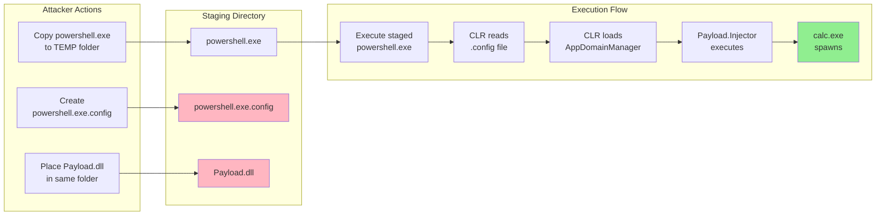
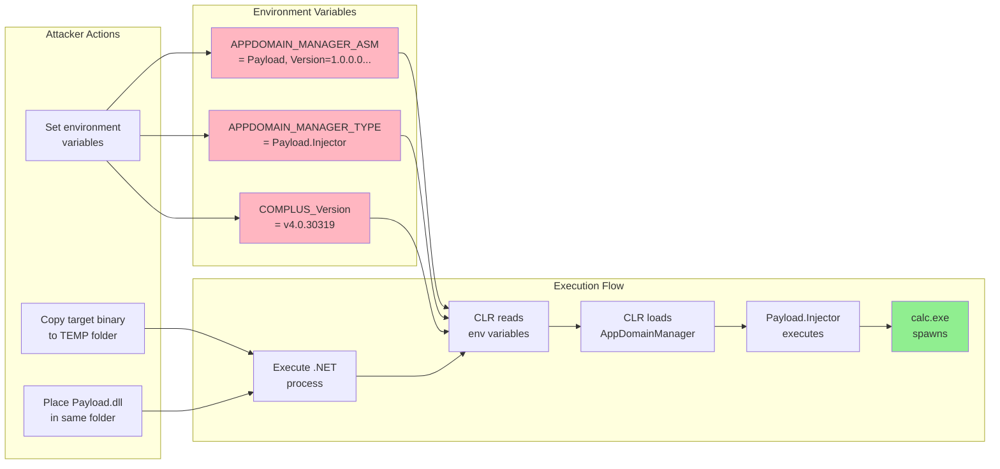
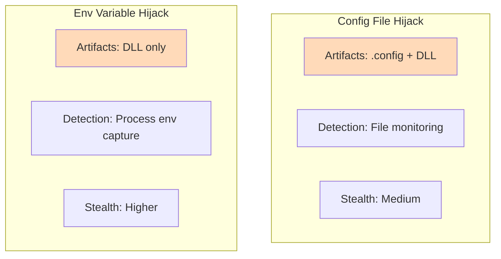

# AppDomainInjector

Purple Team tool for simulating AppDomain Injection techniques. Validates whether endpoint detection and response (EDR) solutions detect this TTP.

## Overview

AppDomain Injection is a technique that allows execution of arbitrary .NET code within the context of a legitimate Microsoft-signed process. This tool implements two variants:

1. **Config File Hijack** - Abuses `.exe.config` files to load a malicious AppDomainManager
2. **Environment Variable Hijack** - Uses `APPDOMAIN_MANAGER_*` environment variables

**Payload:** Benign (spawns `calc.exe`) for safe Purple Team testing.

## How It Works

### Technique 1: Config File Hijack



**Config file content:**
```xml
<configuration>
  <runtime>
    <appDomainManagerAssembly value="Payload, Version=1.0.0.0, ..." />
    <appDomainManagerType value="Payload.Injector" />
  </runtime>
</configuration>
```

### Technique 2: Environment Variable Hijack



### Comparison



## MITRE ATT&CK Mapping

| Technique ID | Name | Description |
|--------------|------|-------------|
| T1055 | Process Injection | Code execution in context of another process |
| T1574.001 | Hijack Execution Flow: DLL Search Order Hijacking | Abuse of DLL/config loading |
| T1059.001 | Command and Scripting Interpreter: PowerShell | Commonly targeted process |

## Quick Start

### Build

```bash
# Using .NET CLI
dotnet build AppDomainInjector.sln -c Release

# Using MSBuild
msbuild AppDomainInjector.sln /p:Configuration=Release
```

### Run

```bash
# Copy Payload.dll to same directory as AppDomainInjector.exe
copy src\Payload\bin\Release\net472\Payload.dll src\AppDomainInjector\bin\Release\net472\

# Execute
cd src\AppDomainInjector\bin\Release\net472
AppDomainInjector.exe --help
```

## Usage

```
Usage: AppDomainInjector.exe [options]

Options:
  -t, --technique <type>   Injection technique: config, env, or both (default: config)
  -T, --target <binary>    Target .NET binary (default: powershell.exe)
  -p, --payload <path>     Path to payload DLL (default: ./Payload.dll)
  -l, --list-targets       List available .NET binaries
  -i, --iocs               Print IOCs after execution
  -n, --no-cleanup         Don't cleanup staging directory
  -h, --help               Show this help
```

### Examples

```bash
# Config hijack with PowerShell
AppDomainInjector.exe --technique config --target powershell.exe

# Environment variable hijack with MSBuild
AppDomainInjector.exe --technique env --target msbuild.exe

# Execute both techniques and show IOCs
AppDomainInjector.exe --technique both --iocs

# List available .NET targets
AppDomainInjector.exe --list-targets
```

## Expected Behavior

When successful, the tool will:
1. Display execution progress
2. Spawn `calc.exe` (benign payload)
3. Optionally display IOCs generated

**If calc.exe appears, the technique succeeded.**

## Documentation

| Document | Description |
|----------|-------------|
| [TECHNIQUE.md](docs/TECHNIQUE.md) | Technical deep-dive on how the techniques work |
| [DETECTION.md](docs/DETECTION.md) | Blue team guide with detection rules and IOCs |
| [MITRE_MAPPING.md](docs/MITRE_MAPPING.md) | Full MITRE ATT&CK mapping and procedures |

## Purple Team Workflow

1. **Before Test:**
   - Ensure detection rules are deployed
   - Baseline current alert count
   - Notify SOC of testing window

2. **Execute Test:**
   ```bash
   AppDomainInjector.exe --technique both --iocs
   ```

3. **Validate:**
   - Check SIEM for alerts
   - Verify EDR detected the activity
   - Document gaps

4. **Report:**
   - Techniques tested
   - Detections that fired
   - Gaps identified
   - Remediation recommendations

## Requirements

- Windows 10/11
- .NET Framework 4.7.2+
- Administrator privileges (recommended)

## Legal Disclaimer

This tool is provided for authorized security testing and educational purposes only. Users are responsible for ensuring they have proper authorization before using this tool. Unauthorized use of this tool against systems you do not own or have permission to test is illegal.

## License

MIT License - See [LICENSE](LICENSE)

## References

- [MITRE ATT&CK - T1055](https://attack.mitre.org/techniques/T1055/)
- [MITRE ATT&CK - T1574.001](https://attack.mitre.org/techniques/T1574/001/)
- [Microsoft Docs - AppDomainManager](https://docs.microsoft.com/en-us/dotnet/api/system.appdomainmanager)
